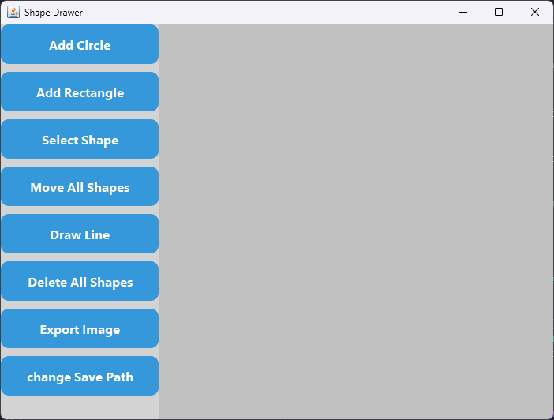

# Shape Drawer

A simple Java desktop application that allows users to draw, select, and move basic shapes such as rectangles, circles, and lines. Built using object-oriented principles and Gradle as the build tool.

## Features

- 🟦 Draw rectangles
- ⚪ Draw circles
- ➖ Draw lines
- 🖱️ Select and move shapes using the mouse
- 🧱 Modular object-oriented architecture for easy extensibility
- 🪟 Built as a standard Java desktop (Swing/JavaFX) application

## Technologies Used

- Java (OOP)
- Gradle (build tool)
- Java Swing or JavaFX (for GUI)

## 📸 ScreenShot
>
> 

## Getting Started

### Prerequisites

- Java 17+ installed
- Gradle installed (or use the Gradle wrapper)

### Clone the Repository

```bash
git clone https://github.com/user5012/ShapeDrawer.git
cd shape-drawer
```

### Build the Project

```bash
gradle build
```

### Run the Project

```bash
gradle run
```

## Future Enhancements

- Add undo/redo functionality

- Support for color and stroke width customization

- Save and load drawing projects

## License

This project is licensed under the MIT License - see the [LICENSE](LICENSE) file for details.
